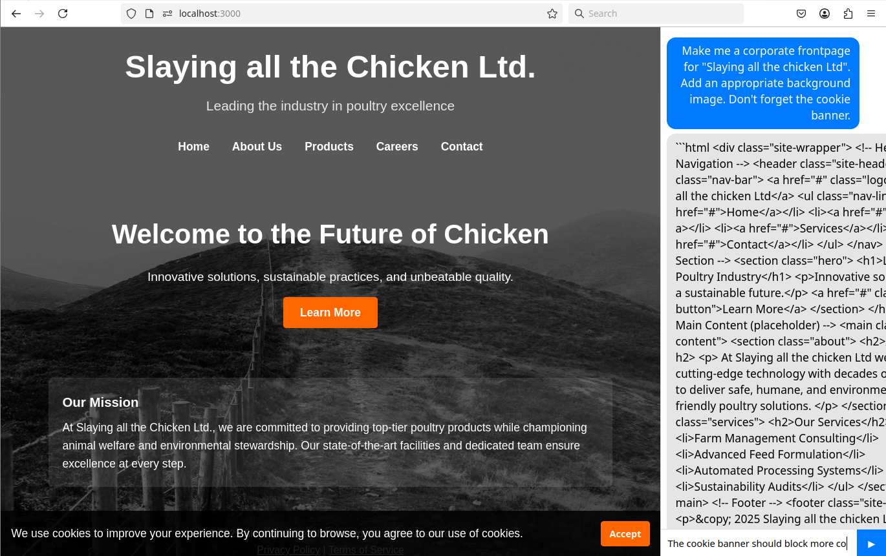

Here's a silly thing I made with gpt-oss-120B. It embeds an LLM chat into a web page, and has enough script that let's the LLM update the page as you request (HTML, JS, CSS).

I asked gpt-oss to generate the rest of this README and it went completely overboard. If you really want to use this and don't know how, ask an LLM, they'll tell you.

It runs JS code out of LLM in your browser. Use at your own risk.
